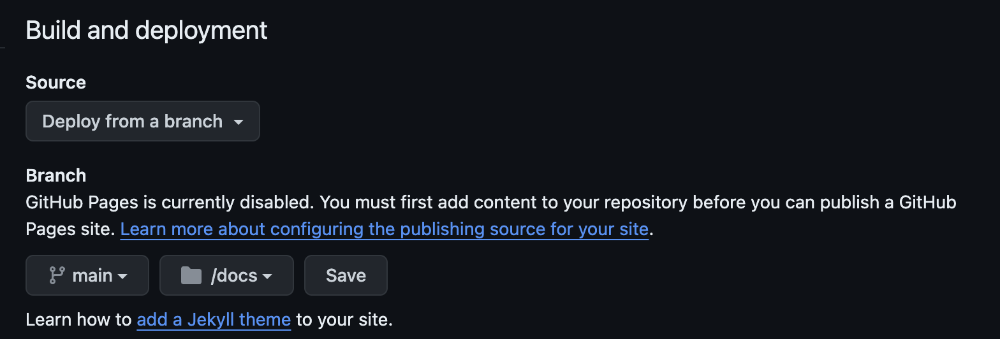
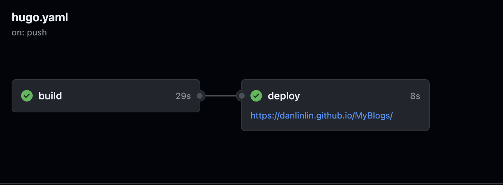

+++
title = 'Building a Personal Website With Hugo and GitHub Pages'
date = 2024-03-18T17:10:38-07:00
draft = false
+++
## 1. Introduction


## 2. What are GitHub Pages and Hugo?

### GitHub Pages:
GitHub Pages is a complimentary hosting service that provides the simplicity and reliability needed for personal and project websites. Its seamless GitHub integration allows for easy updates, supports custom domains, offers SSL encryption for secure connections, and is perfectly suited for static site generators like Jekyll, and by extension, Hugo.

### Hugo:
Hugo is an open-source static site generator that is celebrated for its blazing-fast performance and ease of use. It excels in generating pages in milliseconds, supports a wide range of content types, and leverages Markdown for content creation, offering a straightforward yet flexible way to build websites.

## 3. Prerequisites

- Tools and Accounts Required:
  - A GitHub account
  - Git installed on your computer
  - Hugo installed on your system

## 4. Step-by-Step Guide

### 1. Creating a GitHub Repository:
   Start by creating a new repository on GitHub. This will serve as the home for your website's code and content.

### 2. Installing Hugo:

#### macOS:
```bash
brew install hugo
```

#### Windows:
```bash
choco install hugo -confirm
```

### 3. Creating a New Hugo Site:
```bash
hugo new site [your-site-name] --format yaml #replace [your-site-name] with your site name
```
After creating your site, navigate into your site's directory:
```bash
cd [your-site-name]
```

### 4. Adding a Theme:
Select a theme from the Hugo themes directory. To add the PaperMod theme, for example:
```bash
git submodule add --depth=1 https://github.com/adityatelange/hugo-PaperMod.git themes/PaperMod
git submodule update --remote --merge
```
And in `hugo.yaml`, include:
```yaml
theme: ["PaperMod"]
```

### 5. Adding the Post:
Create your first post with:
```bash
hugo new content/posts/[my-first-post.md] #replace my-first-post.md with your post name
```
Edit the post to add content, remember to set the draft status to false to publish.

### 6. Publishing the Site:
Build your site with Hugo by running:
```bash
hugo
```

### 6. Deploying to GitHub Pages:
Follow these steps to deploy your site to GitHub Pages, including the creation of a deployment script for automation.
#### Create a github repository.
#### Push your local repository to GitHub.
```bash
git branch -M main
git remote add origin [the GitHub repository link]
git add . && git commit -m "Add my first post"
git push main master
```
In the main page of your repository, from the main menu choose `Settings` > `Pages`.
()
#### Create an empty file in your local repository.
Under the [your-site-name] directory
`.github/workflows/hugo.yaml`
```bash
# Sample workflow for building and deploying a Hugo site to GitHub Pages
name: Deploy Hugo site to Pages

on:
  # Runs on pushes targeting the default branch
  push:
    branches:
      - main

  # Allows you to run this workflow manually from the Actions tab
  workflow_dispatch:

# Sets permissions of the GITHUB_TOKEN to allow deployment to GitHub Pages
permissions:
  contents: read
  pages: write
  id-token: write

# Allow only one concurrent deployment, skipping runs queued between the run in-progress and latest queued.
# However, do NOT cancel in-progress runs as we want to allow these production deployments to complete.
concurrency:
  group: "pages"
  cancel-in-progress: false

# Default to bash
defaults:
  run:
    shell: bash

jobs:
  # Build job
  build:
    runs-on: ubuntu-latest
    env:
      HUGO_VERSION: 0.124.0
    steps:
      - name: Install Hugo CLI
        run: |
          wget -O ${{ runner.temp }}/hugo.deb https://github.com/gohugoio/hugo/releases/download/v${HUGO_VERSION}/hugo_extended_${HUGO_VERSION}_linux-amd64.deb \
          && sudo dpkg -i ${{ runner.temp }}/hugo.deb
      - name: Install Dart Sass
        run: sudo snap install dart-sass
      - name: Checkout
        uses: actions/checkout@v4
        with:
          submodules: recursive
          fetch-depth: 0
      - name: Setup Pages
        id: pages
        uses: actions/configure-pages@v4
      - name: Install Node.js dependencies
        run: "[[ -f package-lock.json || -f npm-shrinkwrap.json ]] && npm ci || true"
      - name: Build with Hugo
        env:
          # For maximum backward compatibility with Hugo modules
          HUGO_ENVIRONMENT: production
          HUGO_ENV: production
        run: |
          hugo \
            --gc \
            --minify \
            --baseURL "${{ steps.pages.outputs.base_url }}/"
      - name: Upload artifact
        uses: actions/upload-pages-artifact@v3
        with:
          path: ./public

  # Deployment job
  deploy:
    environment:
      name: github-pages
      url: ${{ steps.deployment.outputs.page_url }}
    runs-on: ubuntu-latest
    needs: build
    steps:
      - name: Deploy to GitHub Pages
        id: deployment
        uses: actions/deploy-pages@v4
```
#### Commit the change to your local repository and push to GitHub
```bash
git add . && git commit -m "Add my workflow"
git push -u origin/master
```
In your github repository, under the action tab, you will see

## Additional Resources

- **[GitHub Pages Documentation](https://docs.github.com/en/pages/getting-started-with-github-pages)**
- **[Hugo Documentation](https://gohugo.io/documentation/)**